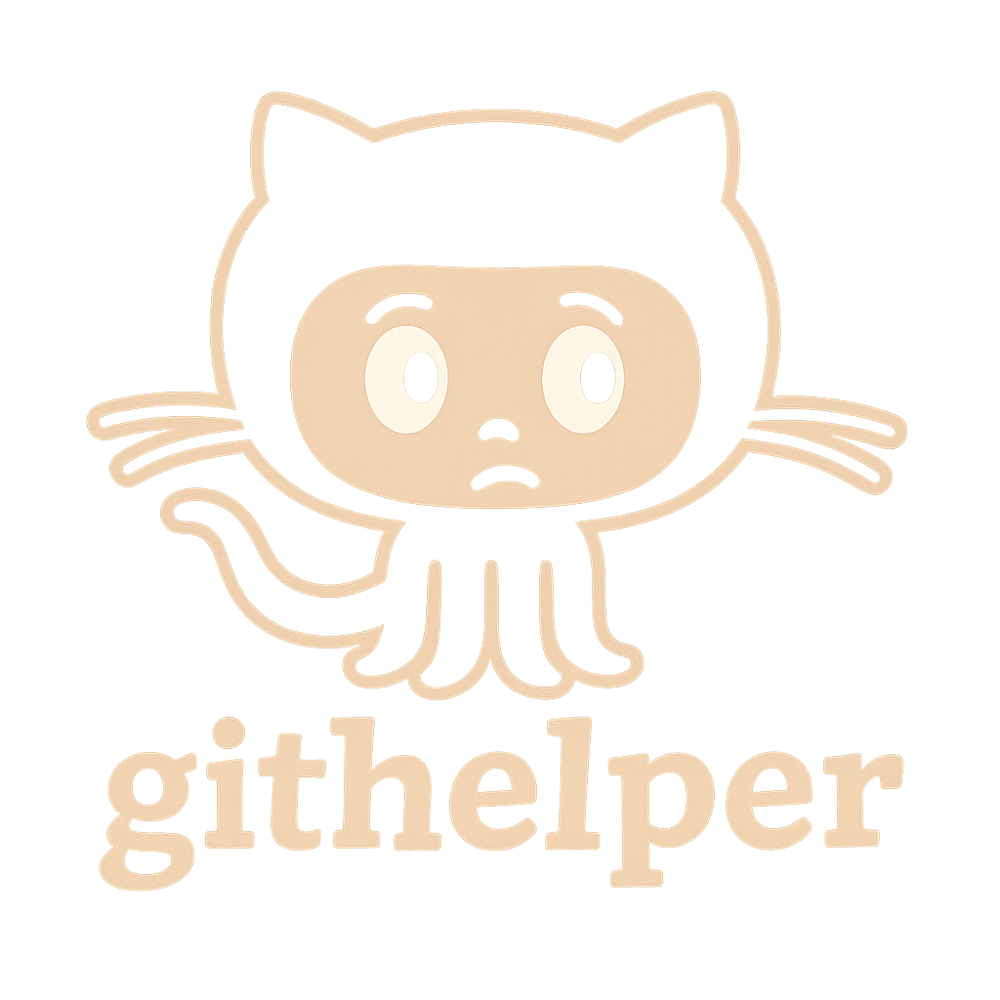

# Termux Scripts

A collection of my small utilities for the Termux environment.

<p align="center" style="margin-bottom:0;">
  
</p>

## Requirements
The scripts are for Termux. Install widget and API as well for full functionality:

<table align="center">
  <tr>
    <td>
      <p><strong>Termux</strong></p>
      <a href="https://f-droid.org/packages/com.termux/">
        
      </a>
    </td>
    <td>
      <p><strong>Termux Widget</strong></p>
      <a href="https://f-droid.org/packages/com.termux.widget/">
        
      </a>
    </td>
    <td>
      <p><strong>Termux:API</strong></p>
      <a href="https://f-droid.org/packages/com.termux.api/">
        
      </a>
    </td>
  </tr>
</table>


## Installation
Run `./scripts/installer.sh` to install the scripts. They are copied to `~/bin/termux-scripts`, shortcuts under `~/.shortcuts/termux-scripts`, and an alias file in `~/.aliases.d/`. Missing packages will be offered for installation automatically. The installer also sets executable permissions so commands like `gpullall` and `gpull` work immediately. It appends `~/bin/termux-scripts` to your `~/.bashrc` and exports it so the utilities are available right away. The alias file is sourced as soon as it's installed. Pass `-u` to remove everything created by a previous run.

To install the stable release run:

```bash
curl -L https://github.com/alexknuckles/termux-scripts/releases/latest/download/installer.sh | bash
```

To install the testing version run:

```bash
curl -L https://github.com/alexknuckles/termux-scripts/releases/download/testing/installer.sh | bash
```

The testing installer automatically clones this repository to a temporary directory and installs from the latest commit.
The installer updates your shell configuration to source every `*.aliases` file in `~/.aliases.d/` on startup.
Shortcut scripts are located in the `termux-scripts-shortcuts` directory.
Run the installer with `-u` to remove the symlinks, shortcuts and alias file and clean up the shell configuration. A new shell starts afterward so any loaded aliases are cleared.

## wallai.sh

<p align="center" style="margin-bottom:0;">
  
</p>

Generates an AI-based wallpaper using the free Pollinations API. The script requests a 15-word
description for a random theme using a random seed so prompts vary even for the same theme.
You can choose between several Pollinations **image** models using the `-im`
flag or let the script pick one at random with `-r`. Models are retrieved from
the Pollinations API. If that fails the script falls back to `flux`, `turbo`
and `gptimage`. The random option ignores `gptimage` (requires a
flower-tier account) and `turbo` due to low quality. The default image model is
`flux`. The text prompt can be generated with a different model selected using
`-pm` (defaults to `default`).

### Usage
```bash
wallai [-d [mode]] [-f [group]] [-g [group]] [-h] [-i [group]] [-k token] [-l] [-im model] [-pm model] [-tm model] [-sm model] \
       [-n "text"] [-p "prompt text"] [-r] [-t theme] [-v] [-w] [-s style]
```

Environment variables:
- `ALLOW_NSFW` set to `false` to disallow NSFW prompts (defaults to `true`).

Flags:
- `-d [mode]` Discover a new theme and/or style using Pollinations. Modes are `theme`, `style` or both if omitted.
- `-f [group]` Save the wallpaper to a favorites group (defaults to `main`).
- `-g [group]` Generate using themes and styles from a group.
- `-h` Show help and exit.
- `-i [group]` Choose a theme and style inspired by favorites from the specified group (defaults to `main`).
- `-k token` Save your Pollinations token to the group used with `-g`. This does not change any global token setting.
- `-l` Use the theme and style from the last generated image if either is omitted.
- `-im` Pollinations model for image generation. Models come from the API and usually
  include `flux`, `turbo` and `gptimage`. `flux` is used if none is provided.
  The `gptimage` model requires a flower-tier Pollinations account; without
  access the API returns an error. The `turbo` model tends to produce lower quality images.
- `-pm` Pollinations model for prompt generation. Defaults to `default`.
- `-tm` Pollinations model for theme discovery.
- `-sm` Pollinations model for style discovery.
- `-n` Custom negative prompt. Defaults to `blurry, low quality, deformed, disfigured, out of frame, low contrast, bad anatomy`.
- `-p` Specify your own prompt text.
- `-r` Pick a random model from the available list, excluding `gptimage` and `turbo`.
- `-t` Choose a theme.
- `-v` Enable verbose output for API requests and responses.
- `-w` Append current weather, time, season and holiday to the prompt.
- `-s` Select a visual style. If omitted, one is picked at random.

Wallai keeps per-group settings in `~/.wallai/config.yml`. The file is created
automatically with a `main` group on first run. Each group can specify
paths for generated images and favorites, whether NSFW prompts are allowed,
the prompt model used for discovery, the image model used for generation and
lists of themes and styles.
You can store a Pollinations token for each group using `-k`, saved under that
group's entry along with `prompt_model` and `image_model` preferences.
If `-tm` or `-sm` are supplied when a new group is created, the selected models
are also stored under `prompt_model`.
All generation activity is logged to `~/.wallai/wallai.log` so commands like
`wallai -f` always operate on the most recent wallpaper regardless of group.
The default configuration also
includes all built‑in themes
(`dreamcore`, `mystical forest`, `cosmic horror`, `ethereal landscape`,
`retrofuturism`, `alien architecture`, `cyberpunk metropolis`) and styles
(`unreal engine`, `cinematic lighting`, `octane render`, `hyperrealism`,
`volumetric lighting`, `high detail`, `4k concept art`).

The final prompt is built as `(theme:1.5) description (style:1.3) [negative prompt: ...]` so the generated image strongly reflects the chosen theme and style.

After showing the chosen prompt, the script also prints which Pollinations image
model will be used.

If no prompt is provided, the script retrieves a themed picture description from the Pollinations text
API using a random genre such as **dreamcore** or **cyberpunk metropolis**. A style such as
**unreal engine** or **cinematic lighting** is also selected unless you supply `-y style`.
You can set the theme with `-t theme`. The API is asked to respond in exactly 15 words
and each API request uses a new seed. These seeds are stored so results can be repeated.
If the request fails, wallai retries up to three times before choosing a prompt from a built-in
fallback list so generation can continue offline. Image generation itself also retries if the
initial request fails.

Dependencies: `curl`, `jq`, `termux-wallpaper`, optional `exiftool` for the `-f` option (also used by the `walfave` alias).
Images are saved as PNG or JPEG depending on what the API returns.
If any of these tools are missing the script exits with a clear error
message. Internet access is required for fetching prompts and generating
the image.

The installer creates a `walfave` alias and `walfave-shortcut.sh` so you
can archive the currently set wallpaper with metadata via `wallai -f` without generating a new image.
It also installs `walfave-group-shortcut.sh` which lets you pick the favorites group using on-screen buttons.

Use `wallai -b` to browse previously generated wallpapers and archive them to a favorites group. The option
lists files under `~/pictures/generated-wallpapers`, opens the selected image with `termux-open`, then asks whether
to add it to a group. If no group is specified and multiple groups exist, wallai prompts for one.

## githelper.sh

<p align="center" style="margin-bottom:0;">
  
</p>

Provides shortcuts for common git tasks and automates pulling
all repositories under `~/git`.

### Usage
```bash
githelper <pull-all|push-all|status|pull|push|clone|init|revert-last|clone-mine|newrepo|set-next|set-next-all>
```

Examples:
- `githelper pull-all` updates every repository in `~/git`.
- `githelper push-all` stages, commits and pushes each repository in `~/git` to its main branch. Use `-c` to enter a commit message for all.
- `githelper status` shows a short status for the current repository.
- `githelper pull` pulls the latest changes for the current repository.
- `githelper push` stages any changes, commits with "gpush-ed" and pushes to `origin/main`.
- `githelper clone -u <url>` clones a repository using `gh` if available.
- `githelper init` initializes a new repo in the current directory.
- `githelper revert-last` reverts the most recent commit.
- `githelper clone-mine` clones all your GitHub repositories to `~/git`. Specify a different user with `-u`.
- `githelper newrepo [-d dir] [-n] [-m description]` initializes a repository on the `main` branch and generates a README and agents file. If `gh` is installed, it creates a private GitHub repo named after the directory and pushes the initial commit. Scanning files is enabled by default; use `-n` to disable scanning, `-d` to choose a directory and `-m` to provide a description. The script uses the Pollinations API but falls back to plain text if the response isn't valid JSON.
- `githelper set-next` creates a prerelease with the `testing` tag by default. Use `-r` for a full release which automatically increments from the latest `v*` tag.
- `githelper set-next-all` runs the same command across every repository in `~/git`.
- Both `set-next` and `set-next-all` ensure `gh auth setup-git` has configured credentials so pushes won't prompt for a password.

Dependencies: `git`, `jq`, optional `gh` for GitHub integration.
Use `scripts/lint.sh` to run ShellCheck and `scripts/security_check.sh` to scan for risky patterns.

