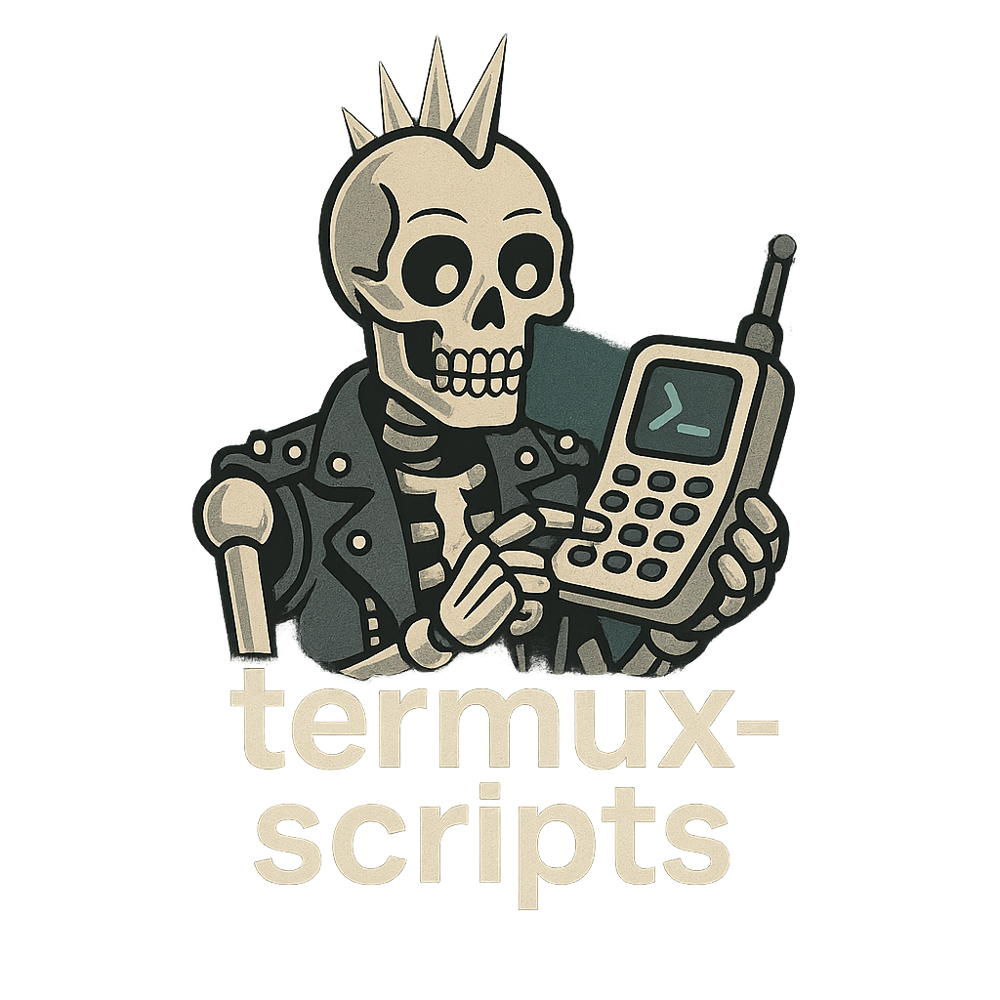

# Termux Scripts

A collection of my small utilities for the Termux environment.

<p align="center" style="margin-bottom:0;">
  
</p>

## Requirements
The scripts are for Termux. Install widget and API as well for full functionality:

<table align="center">
  <tr>
    <td>
      <p><strong>Termux</strong></p>
      <a href="https://f-droid.org/packages/com.termux/">
        
      </a>
    </td>
    <td>
      <p><strong>Termux Widget</strong></p>
      <a href="https://f-droid.org/packages/com.termux.widget/">
        
      </a>
    </td>
    <td>
      <p><strong>Termux:API</strong></p>
      <a href="https://f-droid.org/packages/com.termux.api/">
        
      </a>
    </td>
  </tr>
</table>


## Installation
Run `./scripts/installer.sh` to install the scripts. They are copied to `~/bin/termux-scripts`, shortcuts under `~/.shortcuts/termux-scripts`, and an alias file in `~/.aliases.d/`. Missing packages will be offered for installation automatically. The installer also sets executable permissions so commands like `gpullall` and `gpull` work immediately. It appends `~/bin/termux-scripts` to your `~/.bashrc` and exports it so the utilities are available right away. The alias file is sourced as soon as it's installed. Pass `-u` to remove everything created by a previous run. Existing files are replaced when the repository version is newer and each copied file is listed.

To install the stable release run:

```bash
curl -L https://github.com/alexknuckles/termux-scripts/releases/latest/download/installer.sh | bash
```

To install the testing version run:

```bash
curl -L https://github.com/alexknuckles/termux-scripts/releases/download/testing/installer.sh | bash
```

The testing installer automatically clones this repository to a temporary directory and installs from the latest commit.
The installer updates your shell configuration to source every `*.aliases` file in `~/.aliases.d/` on startup.
Shortcut scripts are located in the `termux-scripts-shortcuts` directory.
Run the installer with `-u` to remove the symlinks, shortcuts and alias file and clean up the shell configuration. A new shell starts afterward so any loaded aliases are cleared.

## wallai.sh

<p align="center" style="margin-bottom:0;">
  
</p>

Generates an AI-based wallpaper using OpenAI-compatible APIs. The script requests a 15-word
description for a random theme using a random seed so prompts vary even for the same theme.
Providers are configured in `~/.wallai/config.db` with a global `defaults`
section choosing which provider and models to use. Pollinations is the default
and works without an API key. It uses the `flux` model for image generation,
but you can add OpenAI or OpenRouter keys and switch providers as needed.
You can choose between provider **image** models using the `-im`
flag or let the script pick one at random with `-r`. Models are listed in the configuration
file under each provider. The default image model is set by the config and the text prompt can
be generated with a different model using `-pm`.

### Usage
```bash
wallai [options]
```

General Options:
- `-h`, `--help`         Show this help message
- `-v`                   Enable verbose mode (prints the config path on startup)
- `-g <group>`           Use or create a group config
- `-k <token>`           Save provider token to the group
- `-di <file>`  Generate prompt from image caption

Prompt Customization:
- `-p <prompt>`          Use custom prompt
- `-t <tag>`             Choose tag manually
- `-s <style>`           Choose style manually
- `-m <mood>`            Set mood (optional, affects prompt tone)
- `-n <text>`            Custom negative prompt
- `-w`                   Add weather/time/holiday context
- `-l`                   Use tag/style from last image

Discovery & Inspiration:
- `-d`                   Discover new tags/styles
- `-i [tag|style|pair]`  Use inspired mode from favorites

Image Generation:
 - `-x [n]`               Generate `n` images (runs in parallel when `n` > 1)
- `-f`                   Favorite the image after generation
- `-r`                   Select a random model
- `-im <model>`          Image generation model
- `-pm <model>`          Prompt generation model
- `-tm <model>`          Tag discovery model
- `-sm <model>`          Style discovery model

Wallpapering & History:
- `-u <mode>`            Use previous image (`latest`, `favorites`, `random`)
- `--use group=name`     Limit reuse to a specific group

Examples:
- `wallai.sh -t dreamcore -m surreal -x 3 -f`
- `wallai.sh -u favorites -g sci-fi`
- `wallai.sh -i tag -d`

Environment variables:
- `ALLOW_NSFW` set to `false` to disallow NSFW prompts (defaults to `true`).

Wallai keeps per-group settings in `~/.wallai/config.db`. The file is created
automatically with a `main` group on first run. Each group can specify
paths for generated images and favorites, whether NSFW prompts are allowed,
the prompt model used for discovery, the image model used for generation and
lists of themes and styles.
You can store a provider token for each group using `-k`, saved under that
group's entry along with `prompt_model` and `image_model` preferences.
The config file also contains an `api_providers` section listing Pollinations,
OpenAI and OpenRouter endpoints. The global `defaults` section now uses
Pollinations `openai` for text prompts, tag discovery and style discovery,
and Pollinations `flux` for image generation so new groups work
anonymously without requiring API keys.
If `-pm`, `-tm` or `-sm` are supplied when a new group is created, the selected
models are stored under `prompt_model` with `-pm` becoming the `base` model.
All generation activity is logged to `~/.wallai/wallai.log` so commands like
`wallai -f` always operate on the most recent wallpaper regardless of group.
The default configuration also
includes all built‑in themes
(`dreamcore`, `mystical forest`, `cosmic horror`, `ethereal landscape`,
`retrofuturism`, `alien architecture`, `cyberpunk metropolis`) and styles
(`unreal engine`, `cinematic lighting`, `octane render`, `hyperrealism`,
`volumetric lighting`, `high detail`, `4k concept art`).

The final prompt is built as `(theme:1.5) description (style:1.3) [negative prompt: ...]` so the generated image strongly reflects the chosen theme and style.

After showing the chosen prompt, the script also prints which image model will be used.

If no prompt is provided, the script retrieves a themed picture description from the configured provider
using a random genre such as **dreamcore** or **cyberpunk metropolis**. A style such as
**unreal engine** or **cinematic lighting** is also selected unless you supply `-s style`.
You can set the theme with `-t theme`. The API is asked to respond in exactly 15 words
and each API request uses a new seed. These seeds are stored so results can be repeated.
If the request fails, wallai chooses a prompt from a built-in
fallback list so generation can continue offline. Image generation exits on failure without retrying.

Dependencies: `curl`, `jq`, `termux-wallpaper` (for setting wallpaper), optional `exiftool` for the `-f` option (also used by the `walfave` alias).
Images are saved as PNG or JPEG depending on what the API returns.
The script can run on non-Termux systems for testing - it will generate images but won't set the wallpaper automatically.
If any required tools are missing the script exits with a clear error
message. Internet access is required for fetching prompts and generating
the image.

The installer creates a `walfave` alias and `walfave-shortcut.sh` so you
can archive the currently set wallpaper with metadata via `wallai -f` without generating a new image.
It also installs `walfave-group-shortcut.sh` which lets you pick the favorites group using on-screen buttons.

## githelper.sh

<p align="center" style="margin-bottom:0;">
  
</p>

Provides shortcuts for common git tasks and automates pulling
all repositories under `~/git`.

### Usage
```bash
githelper <pull-all|push-all|status|pull|push|clone|init|revert-last|clone-mine|newrepo|set-next|set-next-all>
```

Examples:
- `githelper pull-all` updates every repository in `~/git`.
- `githelper push-all` stages, commits and pushes each repository in `~/git` to its main branch. Use `-c` to enter a commit message for all.
- `githelper status` shows a short status for the current repository.
- `githelper pull` pulls the latest changes for the current repository.
- `githelper push` stages any changes, commits with "gpush-ed" and pushes to `origin/main`.
- `githelper clone -u <url>` clones a repository using `gh` if available.
- `githelper init` initializes a new repo in the current directory.
- `githelper revert-last` reverts the most recent commit.
- `githelper clone-mine` clones all your GitHub repositories to `~/git`. Specify a different user with `-u`.
- `githelper newrepo [-d dir] [-n] [-m description]` initializes a repository on the `main` branch and generates a README and agents file. If `gh` is installed, it creates a private GitHub repo named after the directory and pushes the initial commit. Scanning files is enabled by default; use `-n` to disable scanning, `-d` to choose a directory and `-m` to provide a description. The script uses the OpenAI-compatible API but falls back to plain text if the response isn't valid JSON.
- `githelper set-next` creates a prerelease with the `testing` tag by default. Use `-r` for a full release which automatically increments from the latest `v*` tag.
- `githelper set-next-all` runs the same command across every repository in `~/git`.
- Both `set-next` and `set-next-all` ensure `gh auth setup-git` has configured credentials so pushes won't prompt for a password.

Dependencies: `git`, `jq`, optional `gh` for GitHub integration.
Use `scripts/lint.sh` to run ShellCheck and `scripts/security_check.sh` to scan for risky patterns.

